# 敵図鑑（全 240 体）

> このファイルは `tools/export_enemy_list.gd` で自動生成しています。直接編集しないでください。

- 強さは出てくるステージで決まる（c-1〜c-9 の雑魚、c-10 のボス。ステージが進むほど強い）。ここの数値は 1 体で出てきたときのもの
- グループで出てくるときは 1 体あたりが少し弱くなる（`StageDatabase.enemy_stats`）
- ステータス式: `EnemyDatabase.stats_for(no)` → `Balance`
- 各チャプター = 雑魚 3 種族 × 色違い 3 ＋ ボス 1 種族 × 色違い 3
- 画像: `docs/bestiary/chapter_XX.jpg`（列 = 雑魚 A / B / C / ボス、行 = 色違い 1〜3）

## CHAPTER 1「はじまりの草原」

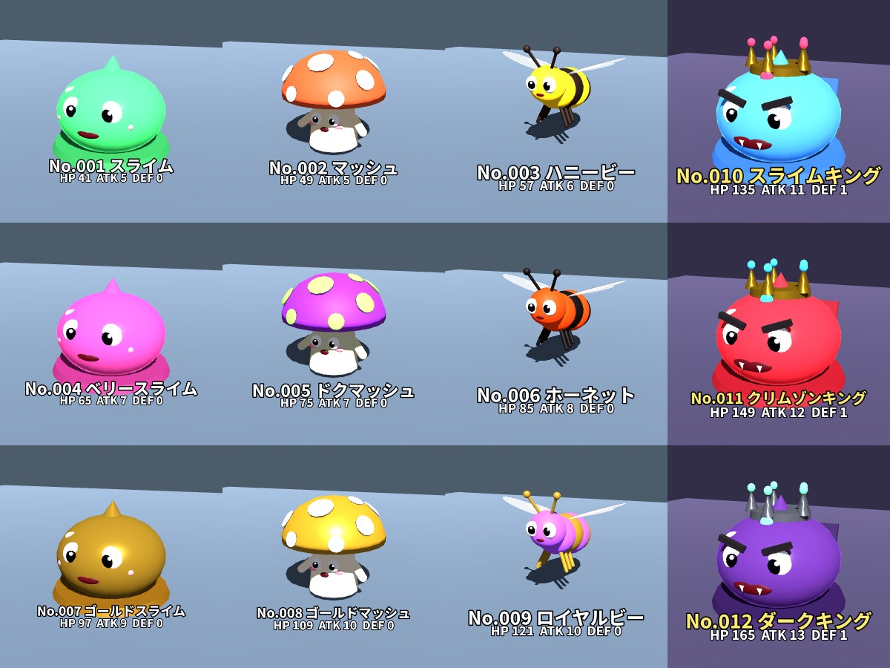

| No. | 名前 | 区分 | HP | 攻撃 | 防御 | 攻撃名 | 説明 |
|---:|---|---|---:|---:|---:|---|---|
| 001 | スライム | 雑魚 | 43 | 5 | 0 | たいあたり | 草原のどこにでもいる、ぷるぷるの魔物。 |
| 002 | マッシュ | 雑魚 | 47 | 5 | 0 | ほうしアタック | 木かげで昼寝をしているキノコ。ふまれると怒る。 |
| 003 | ハニービー | 雑魚 | 52 | 7 | 0 | どくばり | 花畑を守るハチ。おしりの針に注意。 |
| 004 | ベリースライム | 雑魚 | 56 | 7 | 0 | たいあたり | 草原のどこにでもいる、ぷるぷるの魔物。 |
| 005 | ドクマッシュ | 雑魚 | 60 | 8 | 0 | ほうしアタック | 木かげで昼寝をしているキノコ。ふまれると怒る。 |
| 006 | ホーネット | 雑魚 | 65 | 8 | 0 | どくばり | 花畑を守るハチ。おしりの針に注意。 |
| 007 | ゴールドスライム | 雑魚 | 70 | 10 | 0 | たいあたり | 草原のどこにでもいる、ぷるぷるの魔物。 |
| 008 | ゴールドマッシュ | 雑魚 | 75 | 10 | 0 | ほうしアタック | 木かげで昼寝をしているキノコ。ふまれると怒る。 |
| 009 | ロイヤルビー | 雑魚 | 80 | 12 | 0 | どくばり | 花畑を守るハチ。おしりの針に注意。 |
| 010 | スライムキング | **ボス** | 133 | 16 | 0 | のしかかり | スライムたちの王様。大きな体でのしかかってくる。 |
| 011 | クリムゾンキング | **ボス** | 166 | 20 | 0 | のしかかり | スライムたちの王様。大きな体でのしかかってくる。 |
| 012 | ダークキング | **ボス** | 200 | 24 | 0 | のしかかり | スライムたちの王様。大きな体でのしかかってくる。 |

## CHAPTER 2「ゴブリンの森」

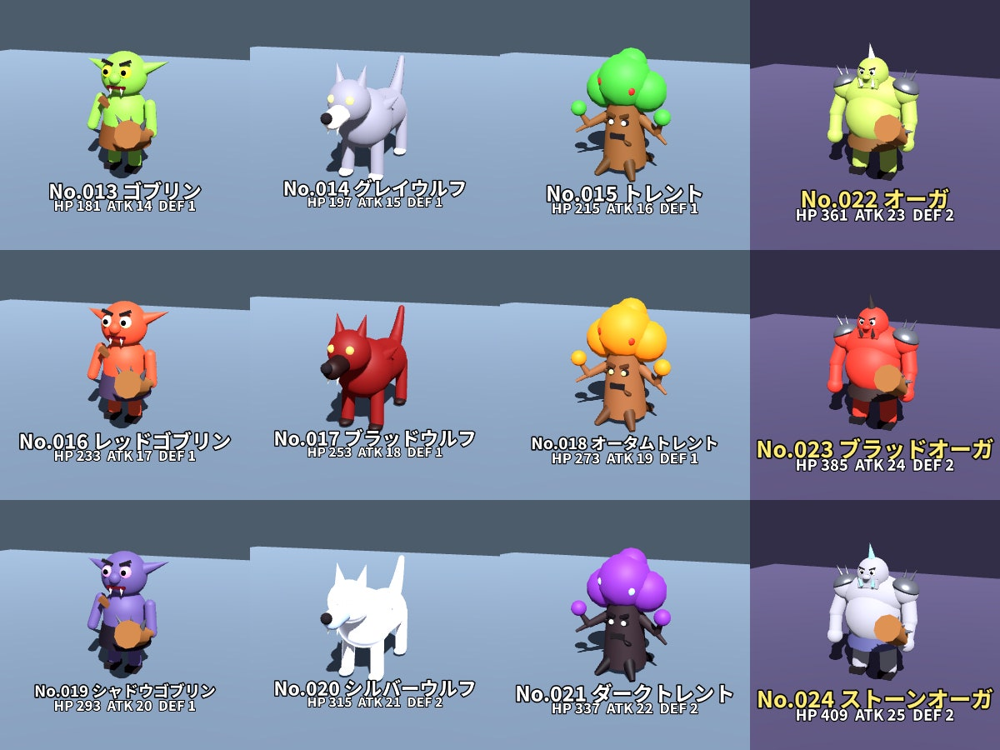

| No. | 名前 | 区分 | HP | 攻撃 | 防御 | 攻撃名 | 説明 |
|---:|---|---|---:|---:|---:|---|---|
| 013 | ゴブリン | 雑魚 | 112 | 14 | 0 | こんぼう攻撃 | 森にすむ小鬼。こんぼうをふりまわして旅人をおそう。 |
| 014 | グレイウルフ | 雑魚 | 131 | 15 | 0 | かみつき | 群れで狩りをするオオカミ。するどい牙をもつ。 |
| 015 | トレント | 雑魚 | 154 | 17 | 0 | えだムチ | 長い年月をへて動きだした古木。えだをムチのようにふるう。 |
| 016 | レッドゴブリン | 雑魚 | 180 | 17 | 0 | こんぼう攻撃 | 森にすむ小鬼。こんぼうをふりまわして旅人をおそう。 |
| 017 | ブラッドウルフ | 雑魚 | 211 | 20 | 0 | かみつき | 群れで狩りをするオオカミ。するどい牙をもつ。 |
| 018 | オータムトレント | 雑魚 | 246 | 20 | 0 | えだムチ | 長い年月をへて動きだした古木。えだをムチのようにふるう。 |
| 019 | シャドウゴブリン | 雑魚 | 287 | 23 | 0 | こんぼう攻撃 | 森にすむ小鬼。こんぼうをふりまわして旅人をおそう。 |
| 020 | シルバーウルフ | 雑魚 | 334 | 24 | 0 | かみつき | 群れで狩りをするオオカミ。するどい牙をもつ。 |
| 021 | ダークトレント | 雑魚 | 389 | 27 | 0 | えだムチ | 長い年月をへて動きだした古木。えだをムチのようにふるう。 |
| 022 | オーガ | **ボス** | 632 | 36 | 0 | トゲこんぼう | 森のぬし。巨大なトゲこんぼうで木々ごとなぎはらう。 |
| 023 | ブラッドオーガ | **ボス** | 790 | 45 | 0 | トゲこんぼう | 森のぬし。巨大なトゲこんぼうで木々ごとなぎはらう。 |
| 024 | ストーンオーガ | **ボス** | 948 | 54 | 0 | トゲこんぼう | 森のぬし。巨大なトゲこんぼうで木々ごとなぎはらう。 |

## CHAPTER 3「灼熱の砂漠」

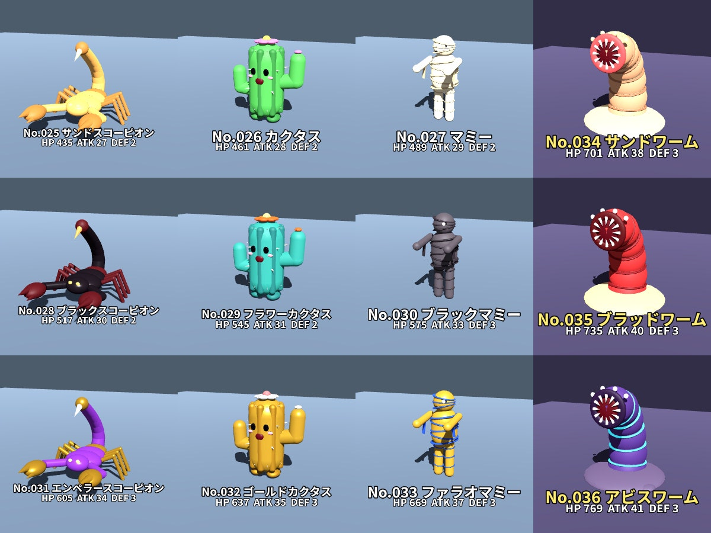

| No. | 名前 | 区分 | HP | 攻撃 | 防御 | 攻撃名 | 説明 |
|---:|---|---|---:|---:|---:|---|---|
| 025 | サンドスコーピオン | 雑魚 | 524 | 31 | 0 | どくのしっぽ | 砂の中にひそむサソリ。しっぽの毒針はとても危険。 |
| 026 | カクタス | 雑魚 | 593 | 32 | 0 | トゲミサイル | 砂漠を歩きまわるサボテン。全身のトゲを飛ばしてくる。 |
| 027 | マミー | 雑魚 | 670 | 36 | 0 | ほうたいしめつけ | ピラミッドからさまよい出たミイラ。ほうたいでしめつける。 |
| 028 | ブラックスコーピオン | 雑魚 | 757 | 37 | 0 | どくのしっぽ | 砂の中にひそむサソリ。しっぽの毒針はとても危険。 |
| 029 | フラワーカクタス | 雑魚 | 854 | 42 | 0 | トゲミサイル | 砂漠を歩きまわるサボテン。全身のトゲを飛ばしてくる。 |
| 030 | ブラックマミー | 雑魚 | 964 | 44 | 0 | ほうたいしめつけ | ピラミッドからさまよい出たミイラ。ほうたいでしめつける。 |
| 031 | エンペラースコーピオン | 雑魚 | 1088 | 49 | 0 | どくのしっぽ | 砂の中にひそむサソリ。しっぽの毒針はとても危険。 |
| 032 | ゴールドカクタス | 雑魚 | 1227 | 51 | 0 | トゲミサイル | 砂漠を歩きまわるサボテン。全身のトゲを飛ばしてくる。 |
| 033 | ファラオマミー | 雑魚 | 1383 | 57 | 0 | ほうたいしめつけ | ピラミッドからさまよい出たミイラ。ほうたいでしめつける。 |
| 034 | サンドワーム | **ボス** | 2140 | 79 | 0 | まるのみ | 砂漠の底からあらわれる大ミミズ。なんでも丸のみにする。 |
| 035 | ブラッドワーム | **ボス** | 2675 | 99 | 0 | まるのみ | 砂漠の底からあらわれる大ミミズ。なんでも丸のみにする。 |
| 036 | アビスワーム | **ボス** | 3210 | 119 | 0 | まるのみ | 砂漠の底からあらわれる大ミミズ。なんでも丸のみにする。 |

## CHAPTER 4「さまよう墓場」

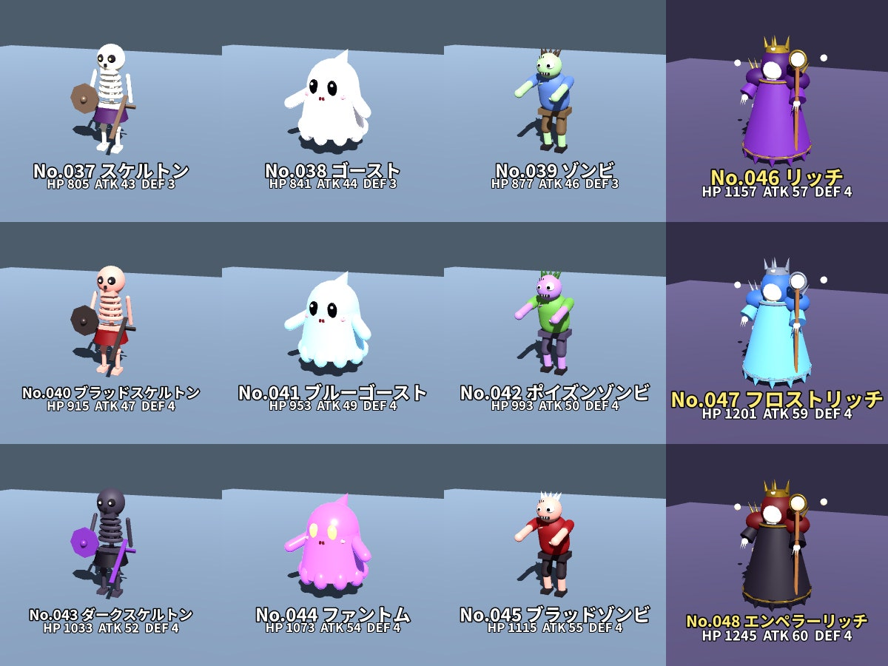

| No. | 名前 | 区分 | HP | 攻撃 | 防御 | 攻撃名 | 説明 |
|---:|---|---|---:|---:|---:|---|---|
| 037 | スケルトン | 雑魚 | 1689 | 68 | 0 | ほねの剣 | 墓場をまもる骨の兵士。何度でも立ち上がる。 |
| 038 | ゴースト | 雑魚 | 1865 | 68 | 0 | おどろかす | 夜の墓場にあらわれるおばけ。体がすけている。 |
| 039 | ゾンビ | 雑魚 | 2059 | 71 | 0 | くさった息 | 墓からはい出してきた死者。動きはのろいがしつこい。 |
| 040 | ブラッドスケルトン | 雑魚 | 2272 | 71 | 0 | ほねの剣 | 墓場をまもる骨の兵士。何度でも立ち上がる。 |
| 041 | ブルーゴースト | 雑魚 | 2507 | 75 | 0 | おどろかす | 夜の墓場にあらわれるおばけ。体がすけている。 |
| 042 | ポイズンゾンビ | 雑魚 | 2765 | 75 | 0 | くさった息 | 墓からはい出してきた死者。動きはのろいがしつこい。 |
| 043 | ダークスケルトン | 雑魚 | 3049 | 79 | 0 | ほねの剣 | 墓場をまもる骨の兵士。何度でも立ち上がる。 |
| 044 | ファントム | 雑魚 | 3362 | 79 | 0 | おどろかす | 夜の墓場にあらわれるおばけ。体がすけている。 |
| 045 | ブラッドゾンビ | 雑魚 | 3705 | 82 | 0 | くさった息 | 墓からはい出してきた死者。動きはのろいがしつこい。 |
| 046 | リッチ | **ボス** | 5716 | 107 | 0 | しのまほう | 永遠の命を手に入れた魔法使いのなれのはて。死者をあやつる。 |
| 047 | フロストリッチ | **ボス** | 7145 | 134 | 0 | しのまほう | 永遠の命を手に入れた魔法使いのなれのはて。死者をあやつる。 |
| 048 | エンペラーリッチ | **ボス** | 8574 | 161 | 0 | しのまほう | 永遠の命を手に入れた魔法使いのなれのはて。死者をあやつる。 |

## CHAPTER 5「くらやみの洞窟」

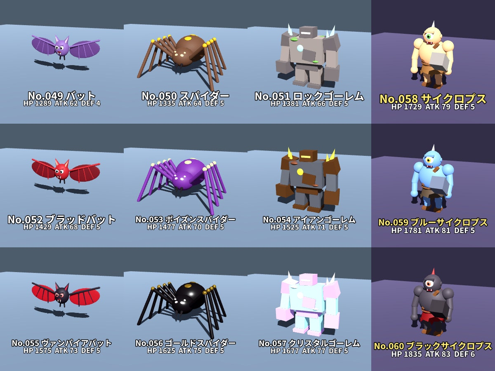

| No. | 名前 | 区分 | HP | 攻撃 | 防御 | 攻撃名 | 説明 |
|---:|---|---|---:|---:|---:|---|---|
| 049 | バット | 雑魚 | 4497 | 86 | 0 | きゅうけつ | 洞窟の天井にぶらさがるコウモリ。暗やみでも正確にかみつく。 |
| 050 | スパイダー | 雑魚 | 4953 | 86 | 0 | どくのキバ | 洞窟に巣をはる大グモ。8つの目で獲物をのがさない。 |
| 051 | ロックゴーレム | 雑魚 | 5454 | 89 | 0 | ロックパンチ | 魔力で動く岩の巨人。とてもかたく、パンチは強烈。 |
| 052 | ブラッドバット | 雑魚 | 6004 | 89 | 0 | きゅうけつ | 洞窟の天井にぶらさがるコウモリ。暗やみでも正確にかみつく。 |
| 053 | ポイズンスパイダー | 雑魚 | 6608 | 93 | 0 | どくのキバ | 洞窟に巣をはる大グモ。8つの目で獲物をのがさない。 |
| 054 | アイアンゴーレム | 雑魚 | 7271 | 93 | 0 | ロックパンチ | 魔力で動く岩の巨人。とてもかたく、パンチは強烈。 |
| 055 | ヴァンパイアバット | 雑魚 | 7999 | 96 | 0 | きゅうけつ | 洞窟の天井にぶらさがるコウモリ。暗やみでも正確にかみつく。 |
| 056 | ゴールドスパイダー | 雑魚 | 8798 | 96 | 0 | どくのキバ | 洞窟に巣をはる大グモ。8つの目で獲物をのがさない。 |
| 057 | クリスタルゴーレム | 雑魚 | 9676 | 100 | 0 | ロックパンチ | 魔力で動く岩の巨人。とてもかたく、パンチは強烈。 |
| 058 | サイクロプス | **ボス** | 15015 | 130 | 0 | いわくだき | 洞窟の奥にすむ一つ目の巨人。石のハンマーで大地をくだく。 |
| 059 | ブルーサイクロプス | **ボス** | 18769 | 163 | 0 | いわくだき | 洞窟の奥にすむ一つ目の巨人。石のハンマーで大地をくだく。 |
| 060 | ブラックサイクロプス | **ボス** | 22523 | 195 | 0 | いわくだき | 洞窟の奥にすむ一つ目の巨人。石のハンマーで大地をくだく。 |

## CHAPTER 6「こおりの山」

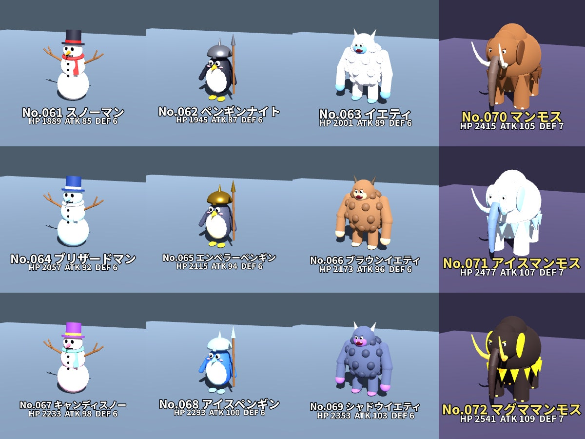

| No. | 名前 | 区分 | HP | 攻撃 | 防御 | 攻撃名 | 説明 |
|---:|---|---|---:|---:|---:|---|---|
| 061 | スノーマン | 雑魚 | 11886 | 104 | 0 | ゆきだまアタック | 雪山で生まれた雪だるま。雪玉をぶつけてくる。 |
| 062 | ペンギンナイト | 雑魚 | 13171 | 104 | 0 | こおりのヤリ | 氷の城をまもるペンギンの騎士。小さな体で勇かんにたたかう。 |
| 063 | イエティ | 雑魚 | 14592 | 107 | 0 | ふぶきパンチ | 雪山にすむ毛むくじゃらの大男。ふぶきとともにあらわれる。 |
| 064 | ブリザードマン | 雑魚 | 16163 | 107 | 0 | ゆきだまアタック | 雪山で生まれた雪だるま。雪玉をぶつけてくる。 |
| 065 | エンペラーペンギン | 雑魚 | 17901 | 111 | 0 | こおりのヤリ | 氷の城をまもるペンギンの騎士。小さな体で勇かんにたたかう。 |
| 066 | ブラウンイエティ | 雑魚 | 19822 | 111 | 0 | ふぶきパンチ | 雪山にすむ毛むくじゃらの大男。ふぶきとともにあらわれる。 |
| 067 | キャンディスノー | 雑魚 | 21946 | 114 | 0 | ゆきだまアタック | 雪山で生まれた雪だるま。雪玉をぶつけてくる。 |
| 068 | アイスペンギン | 雑魚 | 24294 | 114 | 0 | こおりのヤリ | 氷の城をまもるペンギンの騎士。小さな体で勇かんにたたかう。 |
| 069 | シャドウイエティ | 雑魚 | 26890 | 118 | 0 | ふぶきパンチ | 雪山にすむ毛むくじゃらの大男。ふぶきとともにあらわれる。 |
| 070 | マンモス | **ボス** | 41661 | 153 | 0 | キバとっしん | 氷河の時代から生きる巨獣。長いキバで何でもつきとばす。 |
| 071 | アイスマンモス | **ボス** | 52076 | 191 | 0 | キバとっしん | 氷河の時代から生きる巨獣。長いキバで何でもつきとばす。 |
| 072 | マグママンモス | **ボス** | 62492 | 230 | 0 | キバとっしん | 氷河の時代から生きる巨獣。長いキバで何でもつきとばす。 |

## CHAPTER 7「ほのおの火山」

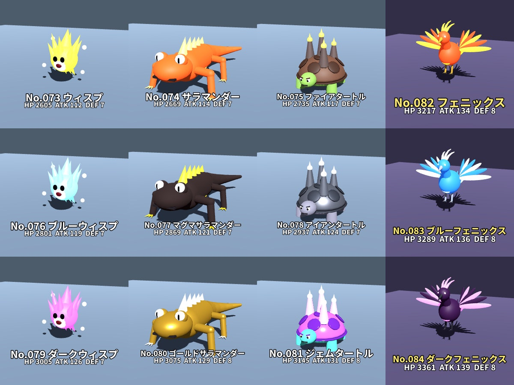

| No. | 名前 | 区分 | HP | 攻撃 | 防御 | 攻撃名 | 説明 |
|---:|---|---|---:|---:|---:|---|---|
| 073 | ウィスプ | 雑魚 | 32927 | 121 | 0 | ひのこ | 火山にただようほのおの精。さわるとやけどする。 |
| 074 | サラマンダー | 雑魚 | 36429 | 121 | 0 | ほのおのいき | 溶岩の中でくらすトカゲ。背中のほのおで体温をたもつ。 |
| 075 | ファイアタートル | 雑魚 | 40298 | 125 | 0 | ふんかこうら | こうらに小さな火山をせおったカメ。ときどき噴火する。 |
| 076 | ブルーウィスプ | 雑魚 | 44572 | 125 | 0 | ひのこ | 火山にただようほのおの精。さわるとやけどする。 |
| 077 | マグマサラマンダー | 雑魚 | 49293 | 129 | 0 | ほのおのいき | 溶岩の中でくらすトカゲ。背中のほのおで体温をたもつ。 |
| 078 | アイアンタートル | 雑魚 | 54507 | 129 | 0 | ふんかこうら | こうらに小さな火山をせおったカメ。ときどき噴火する。 |
| 079 | ダークウィスプ | 雑魚 | 60265 | 132 | 0 | ひのこ | 火山にただようほのおの精。さわるとやけどする。 |
| 080 | ゴールドサラマンダー | 雑魚 | 66624 | 132 | 0 | ほのおのいき | 溶岩の中でくらすトカゲ。背中のほのおで体温をたもつ。 |
| 081 | ジェムタートル | 雑魚 | 73644 | 136 | 0 | ふんかこうら | こうらに小さな火山をせおったカメ。ときどき噴火する。 |
| 082 | フェニックス | **ボス** | 114490 | 176 | 0 | ほうおうのほのお | 火山の火口にすむ不死鳥。ほのおの中から何度でもよみがえる。 |
| 083 | ブルーフェニックス | **ボス** | 143113 | 220 | 0 | ほうおうのほのお | 火山の火口にすむ不死鳥。ほのおの中から何度でもよみがえる。 |
| 084 | ダークフェニックス | **ボス** | 171735 | 264 | 0 | ほうおうのほのお | 火山の火口にすむ不死鳥。ほのおの中から何度でもよみがえる。 |

## CHAPTER 8「しずみの海」

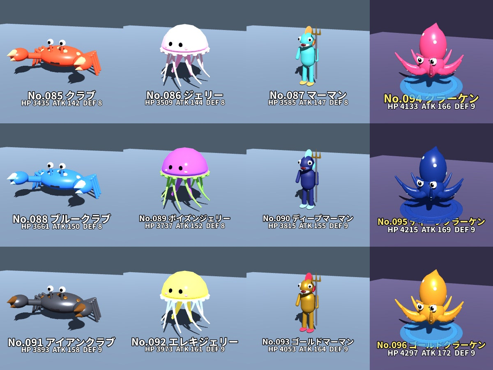

| No. | 名前 | 区分 | HP | 攻撃 | 防御 | 攻撃名 | 説明 |
|---:|---|---|---:|---:|---:|---|---|
| 085 | クラブ | 雑魚 | 90802 | 139 | 0 | はさみうち | 海辺をよこ歩きする大ガニ。大きなハサミで何でもはさむ。 |
| 086 | ジェリー | 雑魚 | 100809 | 139 | 0 | しびれしょくしゅ | ふわふわと海をただようクラゲ。しょくしゅでしびれさせる。 |
| 087 | マーマン | 雑魚 | 111907 | 143 | 0 | トライデント | 海の底の王国の兵士。三つまたのヤリをあやつる。 |
| 088 | ブルークラブ | 雑魚 | 124213 | 143 | 0 | はさみうち | 海辺をよこ歩きする大ガニ。大きなハサミで何でもはさむ。 |
| 089 | ポイズンジェリー | 雑魚 | 137859 | 146 | 0 | しびれしょくしゅ | ふわふわと海をただようクラゲ。しょくしゅでしびれさせる。 |
| 090 | ディープマーマン | 雑魚 | 152988 | 146 | 0 | トライデント | 海の底の王国の兵士。三つまたのヤリをあやつる。 |
| 091 | アイアンクラブ | 雑魚 | 169760 | 150 | 0 | はさみうち | 海辺をよこ歩きする大ガニ。大きなハサミで何でもはさむ。 |
| 092 | エレキジェリー | 雑魚 | 188352 | 150 | 0 | しびれしょくしゅ | ふわふわと海をただようクラゲ。しょくしゅでしびれさせる。 |
| 093 | ゴールドマーマン | 雑魚 | 208961 | 154 | 0 | トライデント | 海の底の王国の兵士。三つまたのヤリをあやつる。 |
| 094 | クラーケン | **ボス** | 324524 | 200 | 0 | しょくしゅのうず | 船をしずめる海の大怪物。8本のしょくしゅでまきつく。 |
| 095 | ディープクラーケン | **ボス** | 405655 | 250 | 0 | しょくしゅのうず | 船をしずめる海の大怪物。8本のしょくしゅでまきつく。 |
| 096 | ゴールドクラーケン | **ボス** | 486786 | 300 | 0 | しょくしゅのうず | 船をしずめる海の大怪物。8本のしょくしゅでまきつく。 |

## CHAPTER 9「魔王城」

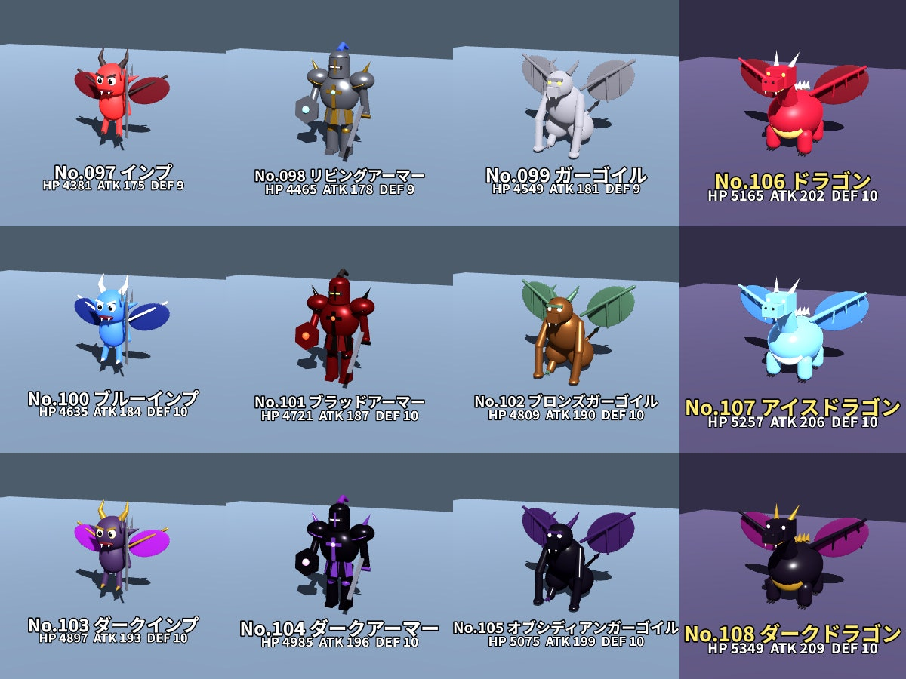

| No. | 名前 | 区分 | HP | 攻撃 | 防御 | 攻撃名 | 説明 |
|---:|---|---|---:|---:|---:|---|---|
| 097 | インプ | 雑魚 | 257118 | 157 | 0 | いたずらフォーク | 魔王城にすみつく小悪魔。いたずらが大好き。 |
| 098 | リビングアーマー | 雑魚 | 285171 | 157 | 0 | まっぷたつ | 中身のない動くよろい。魔王城の廊下を見まわっている。 |
| 099 | ガーゴイル | 雑魚 | 316258 | 161 | 0 | いしのツメ | 城の屋根にいる石像の魔物。近づくと動きだす。 |
| 100 | ブルーインプ | 雑魚 | 350702 | 161 | 0 | いたずらフォーク | 魔王城にすみつく小悪魔。いたずらが大好き。 |
| 101 | ブラッドアーマー | 雑魚 | 388865 | 164 | 0 | まっぷたつ | 中身のない動くよろい。魔王城の廊下を見まわっている。 |
| 102 | ブロンズガーゴイル | 雑魚 | 431144 | 164 | 0 | いしのツメ | 城の屋根にいる石像の魔物。近づくと動きだす。 |
| 103 | ダークインプ | 雑魚 | 477980 | 168 | 0 | いたずらフォーク | 魔王城にすみつく小悪魔。いたずらが大好き。 |
| 104 | ダークアーマー | 雑魚 | 529861 | 168 | 0 | まっぷたつ | 中身のない動くよろい。魔王城の廊下を見まわっている。 |
| 105 | オブシディアンガーゴイル | 雑魚 | 587327 | 171 | 0 | いしのツメ | 城の屋根にいる石像の魔物。近づくと動きだす。 |
| 106 | ドラゴン | **ボス** | 914042 | 223 | 0 | ほのおのツメ | 魔王につかえる伝説の竜。そのほのおは鉄をもとかす。 |
| 107 | アイスドラゴン | **ボス** | 1142553 | 279 | 0 | ほのおのツメ | 魔王につかえる伝説の竜。そのほのおは鉄をもとかす。 |
| 108 | ダークドラゴン | **ボス** | 1371063 | 335 | 0 | ほのおのツメ | 魔王につかえる伝説の竜。そのほのおは鉄をもとかす。 |

## CHAPTER 10「魔界」

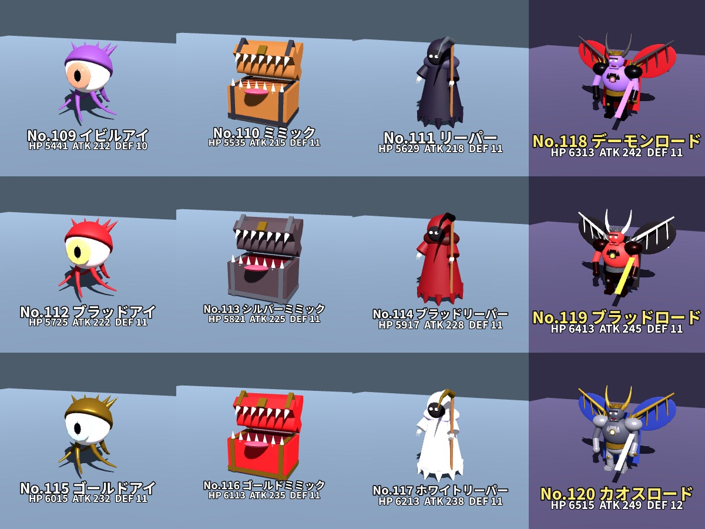

| No. | 名前 | 区分 | HP | 攻撃 | 防御 | 攻撃名 | 説明 |
|---:|---|---|---:|---:|---:|---|---|
| 109 | イビルアイ | 雑魚 | 725709 | 175 | 0 | のろいのまなざし | 魔界にうかぶ巨大な目玉。見つめられると体がすくむ。 |
| 110 | ミミック | 雑魚 | 806593 | 175 | 0 | かみくだき | 宝箱にばけた魔物。あけようとした冒険者をまるかじり。 |
| 111 | リーパー | 雑魚 | 896425 | 179 | 0 | しにがみのカマ | 大きなカマをもつ死神。たましいをかりとりにくる。 |
| 112 | ブラッドアイ | 雑魚 | 996189 | 179 | 0 | のろいのまなざし | 魔界にうかぶ巨大な目玉。見つめられると体がすくむ。 |
| 113 | シルバーミミック | 雑魚 | 1106976 | 182 | 0 | かみくだき | 宝箱にばけた魔物。あけようとした冒険者をまるかじり。 |
| 114 | ブラッドリーパー | 雑魚 | 1229997 | 182 | 0 | しにがみのカマ | 大きなカマをもつ死神。たましいをかりとりにくる。 |
| 115 | ゴールドアイ | 雑魚 | 1366595 | 186 | 0 | のろいのまなざし | 魔界にうかぶ巨大な目玉。見つめられると体がすくむ。 |
| 116 | ゴールドミミック | 雑魚 | 1518259 | 186 | 0 | かみくだき | 宝箱にばけた魔物。あけようとした冒険者をまるかじり。 |
| 117 | ホワイトリーパー | 雑魚 | 1686642 | 189 | 0 | しにがみのカマ | 大きなカマをもつ死神。たましいをかりとりにくる。 |
| 118 | デーモンロード | **ボス** | 2623005 | 246 | 0 | まおうのいちげき | すべての魔物をしたがえる魔王。その力は世界をのみこむ。 |
| 119 | ブラッドロード | **ボス** | 3278756 | 308 | 0 | まおうのいちげき | すべての魔物をしたがえる魔王。その力は世界をのみこむ。 |
| 120 | カオスロード | **ボス** | 3934508 | 369 | 0 | まおうのいちげき | すべての魔物をしたがえる魔王。その力は世界をのみこむ。 |

## CHAPTER 11「おかしの国」

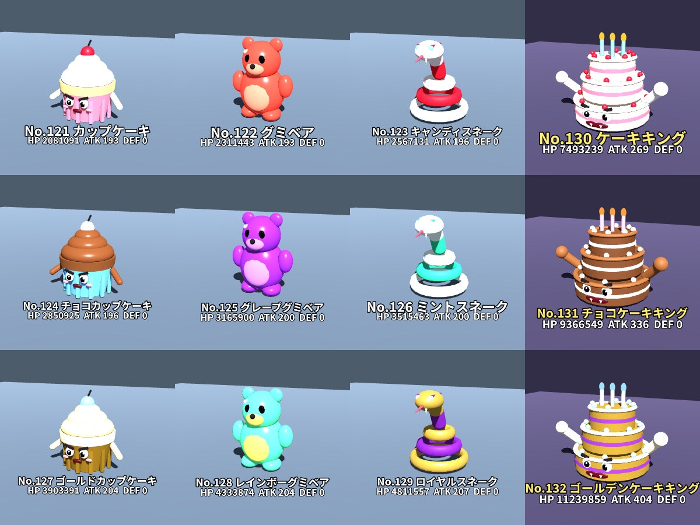

| No. | 名前 | 区分 | HP | 攻撃 | 防御 | 攻撃名 | 説明 |
|---:|---|---|---:|---:|---:|---|---|
| 121 | カップケーキ | 雑魚 | 1974625 | 189 | 0 | クリームアタック | ふわふわのクリームをのせたおかしの魔物。あまい香りで近づいてくる。 |
| 122 | グミベア | 雑魚 | 2081091 | 193 | 0 | ぷにぷにパンチ | すきとおったグミのクマ。たたくとぷるんとはねかえる。 |
| 123 | キャンディスネーク | 雑魚 | 2193262 | 193 | 0 | ぐるぐるまきつき | しま模様のキャンディでできたヘビ。なめるとあまいがかむと痛い。 |
| 124 | チョコカップケーキ | 雑魚 | 2311443 | 193 | 0 | クリームアタック | ふわふわのクリームをのせたおかしの魔物。あまい香りで近づいてくる。 |
| 125 | グレープグミベア | 雑魚 | 2435953 | 193 | 0 | ぷにぷにパンチ | すきとおったグミのクマ。たたくとぷるんとはねかえる。 |
| 126 | ミントスネーク | 雑魚 | 2567131 | 196 | 0 | ぐるぐるまきつき | しま模様のキャンディでできたヘビ。なめるとあまいがかむと痛い。 |
| 127 | ゴールドカップケーキ | 雑魚 | 2705330 | 196 | 0 | クリームアタック | ふわふわのクリームをのせたおかしの魔物。あまい香りで近づいてくる。 |
| 128 | レインボーグミベア | 雑魚 | 2850925 | 196 | 0 | ぷにぷにパンチ | すきとおったグミのクマ。たたくとぷるんとはねかえる。 |
| 129 | ロイヤルスネーク | 雑魚 | 3004310 | 196 | 0 | ぐるぐるまきつき | しま模様のキャンディでできたヘビ。なめるとあまいがかむと痛い。 |
| 130 | ケーキキング | **ボス** | 4432260 | 260 | 0 | スイーツプレス | おかしの国を治める巨大なケーキ。ろうそくの火はいつまでも消えない。 |
| 131 | チョコケーキキング | **ボス** | 5540325 | 325 | 0 | スイーツプレス | おかしの国を治める巨大なケーキ。ろうそくの火はいつまでも消えない。 |
| 132 | ゴールデンケーキキング | **ボス** | 6648390 | 390 | 0 | スイーツプレス | おかしの国を治める巨大なケーキ。ろうそくの火はいつまでも消えない。 |

## CHAPTER 12「からくり工場」

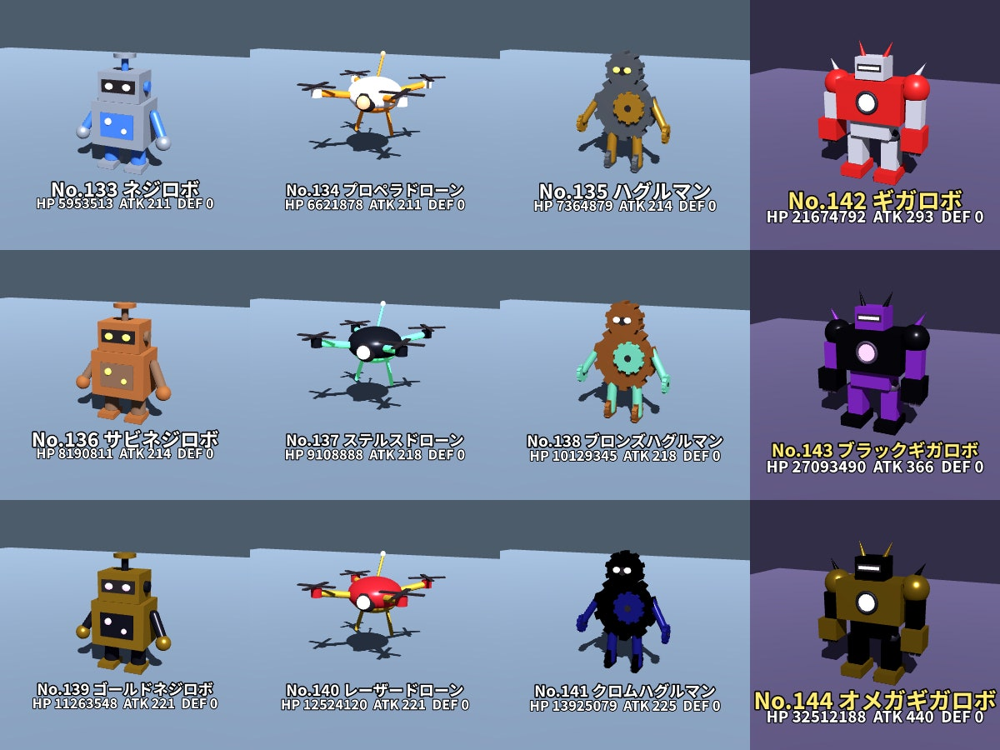

| No. | 名前 | 区分 | HP | 攻撃 | 防御 | 攻撃名 | 説明 |
|---:|---|---|---:|---:|---:|---|---|
| 133 | ネジロボ | 雑魚 | 3336131 | 200 | 0 | ネジまわしパンチ | 工場で生まれた小さなロボット。頭のネジがゆるむと暴れだす。 |
| 134 | プロペラドローン | 雑魚 | 3515463 | 200 | 0 | レーザービーム | 4 つのプロペラで飛ぶ見はりロボ。赤い目で侵入者をさがす。 |
| 135 | ハグルマン | 雑魚 | 3704379 | 200 | 0 | ギアカッター | 歯車が集まってできた魔物。体の歯車をとばしてくる。 |
| 136 | サビネジロボ | 雑魚 | 3903391 | 204 | 0 | ネジまわしパンチ | 工場で生まれた小さなロボット。頭のネジがゆるむと暴れだす。 |
| 137 | ステルスドローン | 雑魚 | 4113034 | 204 | 0 | レーザービーム | 4 つのプロペラで飛ぶ見はりロボ。赤い目で侵入者をさがす。 |
| 138 | ブロンズハグルマン | 雑魚 | 4333874 | 204 | 0 | ギアカッター | 歯車が集まってできた魔物。体の歯車をとばしてくる。 |
| 139 | ゴールドネジロボ | 雑魚 | 4566506 | 204 | 0 | ネジまわしパンチ | 工場で生まれた小さなロボット。頭のネジがゆるむと暴れだす。 |
| 140 | レーザードローン | 雑魚 | 4811557 | 207 | 0 | レーザービーム | 4 つのプロペラで飛ぶ見はりロボ。赤い目で侵入者をさがす。 |
| 141 | クロムハグルマン | 雑魚 | 5074773 | 207 | 0 | ギアカッター | 歯車が集まってできた魔物。体の歯車をとばしてくる。 |
| 142 | ギガロボ | **ボス** | 7493239 | 269 | 0 | ロケットパンチ | 工場の最深部で作られた巨大ロボ。胸のコアが力のみなもと。 |
| 143 | ブラックギガロボ | **ボス** | 9366549 | 336 | 0 | ロケットパンチ | 工場の最深部で作られた巨大ロボ。胸のコアが力のみなもと。 |
| 144 | オメガギガロボ | **ボス** | 11239859 | 404 | 0 | ロケットパンチ | 工場の最深部で作られた巨大ロボ。胸のコアが力のみなもと。 |

## CHAPTER 13「ようせいの花園」

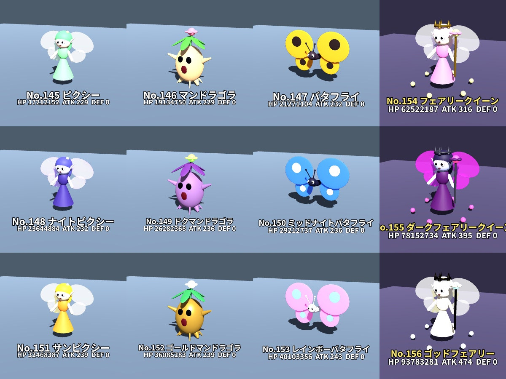

| No. | 名前 | 区分 | HP | 攻撃 | 防御 | 攻撃名 | 説明 |
|---:|---|---|---:|---:|---:|---|---|
| 145 | ピクシー | 雑魚 | 5644954 | 207 | 0 | いたずらまほう | 花のあいだを飛びまわる小さな妖精。いたずらが大好き。 |
| 146 | マンドラゴラ | 雑魚 | 5953513 | 211 | 0 | ひめい | 土からぬけ出した根っこの魔物。さけび声で頭がくらくらする。 |
| 147 | バタフライ | 雑魚 | 6278851 | 211 | 0 | りんぷん | 大きなはねのチョウ。はねからまく粉で眠くなる。 |
| 148 | ナイトピクシー | 雑魚 | 6621878 | 211 | 0 | いたずらまほう | 花のあいだを飛びまわる小さな妖精。いたずらが大好き。 |
| 149 | ドクマンドラゴラ | 雑魚 | 6983551 | 211 | 0 | ひめい | 土からぬけ出した根っこの魔物。さけび声で頭がくらくらする。 |
| 150 | ミッドナイトバタフライ | 雑魚 | 7364879 | 214 | 0 | りんぷん | 大きなはねのチョウ。はねからまく粉で眠くなる。 |
| 151 | サンピクシー | 雑魚 | 7766925 | 214 | 0 | いたずらまほう | 花のあいだを飛びまわる小さな妖精。いたずらが大好き。 |
| 152 | ゴールドマンドラゴラ | 雑魚 | 8190811 | 214 | 0 | ひめい | 土からぬけ出した根っこの魔物。さけび声で頭がくらくらする。 |
| 153 | レインボーバタフライ | 雑魚 | 8637717 | 214 | 0 | りんぷん | 大きなはねのチョウ。はねからまく粉で眠くなる。 |
| 154 | フェアリークイーン | **ボス** | 12752444 | 283 | 0 | フラワーストーム | 花園を守る妖精の女王。花びらのあらしをまきおこす。 |
| 155 | ダークフェアリークイーン | **ボス** | 15940555 | 354 | 0 | フラワーストーム | 花園を守る妖精の女王。花びらのあらしをまきおこす。 |
| 156 | ゴッドフェアリー | **ボス** | 19128666 | 425 | 0 | フラワーストーム | 花園を守る妖精の女王。花びらのあらしをまきおこす。 |

## CHAPTER 14「ゆうれい船」

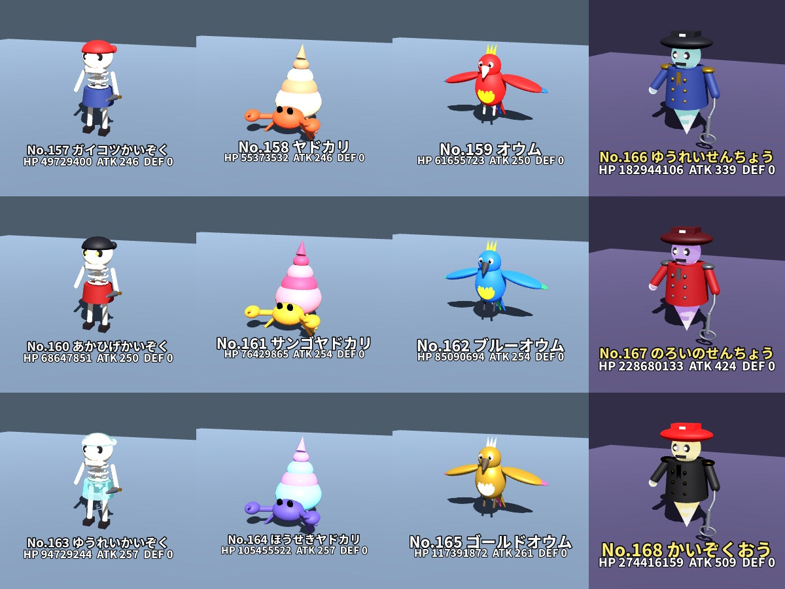

| No. | 名前 | 区分 | HP | 攻撃 | 防御 | 攻撃名 | 説明 |
|---:|---|---|---:|---:|---:|---|---|
| 157 | ガイコツかいぞく | 雑魚 | 9605637 | 218 | 0 | カトラスぎり | ゆうれい船ではたらくガイコツの海賊。こしのカトラスがじまん。 |
| 158 | ヤドカリ | 雑魚 | 10129345 | 218 | 0 | はさみうち | 大きなまき貝を背負ったヤドカリ。貝の中はふかふか。 |
| 159 | オウム | 雑魚 | 10681471 | 218 | 0 | くちばしつつき | 船長のかたにとまるおしゃべりなオウム。悪口もおぼえている。 |
| 160 | あかひげかいぞく | 雑魚 | 11263548 | 221 | 0 | カトラスぎり | ゆうれい船ではたらくガイコツの海賊。こしのカトラスがじまん。 |
| 161 | サンゴヤドカリ | 雑魚 | 11877196 | 221 | 0 | はさみうち | 大きなまき貝を背負ったヤドカリ。貝の中はふかふか。 |
| 162 | ブルーオウム | 雑魚 | 12524120 | 221 | 0 | くちばしつつき | 船長のかたにとまるおしゃべりなオウム。悪口もおぼえている。 |
| 163 | ゆうれいかいぞく | 雑魚 | 13206116 | 221 | 0 | カトラスぎり | ゆうれい船ではたらくガイコツの海賊。こしのカトラスがじまん。 |
| 164 | ほうせきヤドカリ | 雑魚 | 13925079 | 225 | 0 | はさみうち | 大きなまき貝を背負ったヤドカリ。貝の中はふかふか。 |
| 165 | ゴールドオウム | 雑魚 | 14683004 | 225 | 0 | くちばしつつき | 船長のかたにとまるおしゃべりなオウム。悪口もおぼえている。 |
| 166 | ゆうれいせんちょう | **ボス** | 21674792 | 293 | 0 | たいほうぶっぱ | しずんだ船をあやつる海賊の船長。いかりのついたくさりをふりまわす。 |
| 167 | のろいのせんちょう | **ボス** | 27093490 | 366 | 0 | たいほうぶっぱ | しずんだ船をあやつる海賊の船長。いかりのついたくさりをふりまわす。 |
| 168 | かいぞくおう | **ボス** | 32512188 | 440 | 0 | たいほうぶっぱ | しずんだ船をあやつる海賊の船長。いかりのついたくさりをふりまわす。 |

## CHAPTER 15「てんくうの城」

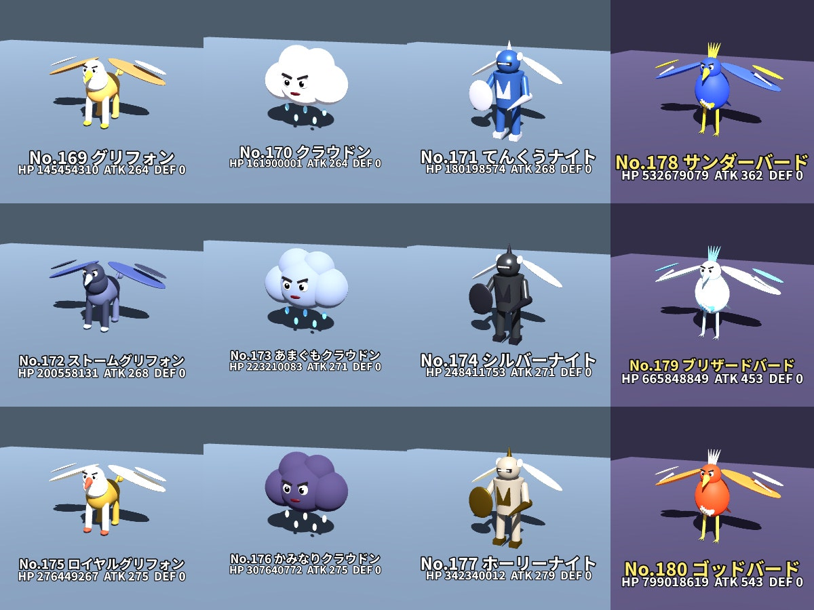

| No. | 名前 | 区分 | HP | 攻撃 | 防御 | 攻撃名 | 説明 |
|---:|---|---|---:|---:|---:|---|---|
| 169 | グリフォン | 雑魚 | 16324265 | 225 | 0 | かぎづめアタック | ワシの頭とライオンの体をもつ空の番人。 |
| 170 | クラウドン | 雑魚 | 17212152 | 229 | 0 | かみなり | ふわふわの雲の魔物。おこると雨やかみなりをふらせる。 |
| 171 | てんくうナイト | 雑魚 | 18148116 | 229 | 0 | ランスチャージ | 天空の城を守るつばさの騎士。ランスの一撃は雲をつらぬく。 |
| 172 | ストームグリフォン | 雑魚 | 19134750 | 229 | 0 | かぎづめアタック | ワシの頭とライオンの体をもつ空の番人。 |
| 173 | あまぐもクラウドン | 雑魚 | 20174786 | 229 | 0 | かみなり | ふわふわの雲の魔物。おこると雨やかみなりをふらせる。 |
| 174 | シルバーナイト | 雑魚 | 21271104 | 232 | 0 | ランスチャージ | 天空の城を守るつばさの騎士。ランスの一撃は雲をつらぬく。 |
| 175 | ロイヤルグリフォン | 雑魚 | 22426738 | 232 | 0 | かぎづめアタック | ワシの頭とライオンの体をもつ空の番人。 |
| 176 | かみなりクラウドン | 雑魚 | 23644884 | 232 | 0 | かみなり | ふわふわの雲の魔物。おこると雨やかみなりをふらせる。 |
| 177 | ホーリーナイト | 雑魚 | 24928911 | 232 | 0 | ランスチャージ | 天空の城を守るつばさの騎士。ランスの一撃は雲をつらぬく。 |
| 178 | サンダーバード | **ボス** | 36795316 | 306 | 0 | いなずまのつばさ | 天空の城の主。つばさをひろげると空がかみなりでみたされる。 |
| 179 | ブリザードバード | **ボス** | 45994145 | 383 | 0 | いなずまのつばさ | 天空の城の主。つばさをひろげると空がかみなりでみたされる。 |
| 180 | ゴッドバード | **ボス** | 55192974 | 459 | 0 | いなずまのつばさ | 天空の城の主。つばさをひろげると空がかみなりでみたされる。 |

## CHAPTER 16「こだいの神殿」

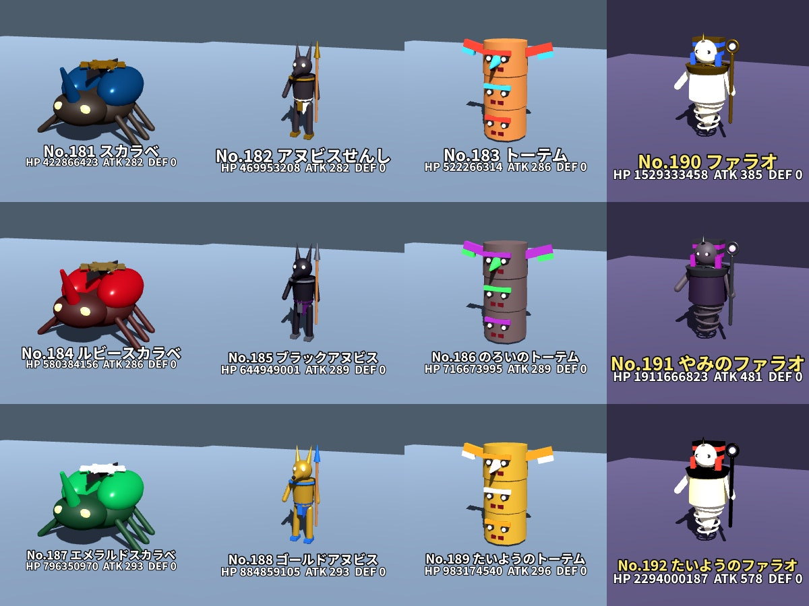

| No. | 名前 | 区分 | HP | 攻撃 | 防御 | 攻撃名 | 説明 |
|---:|---|---|---:|---:|---:|---|---|
| 181 | スカラベ | 雑魚 | 27708997 | 236 | 0 | かたいつの | 神殿の床をはいまわる聖なるコガネムシ。背中は宝石のようにかがやく。 |
| 182 | アヌビスせんし | 雑魚 | 29212737 | 236 | 0 | やりのひとつき | 犬の頭をもつ神殿の戦士。死者の眠りをまもっている。 |
| 183 | トーテム | 雑魚 | 30797742 | 236 | 0 | じならし | 顔がつみかさなった木の柱。3 つの顔が別々にしゃべる。 |
| 184 | ルビースカラベ | 雑魚 | 32468387 | 239 | 0 | かたいつの | 神殿の床をはいまわる聖なるコガネムシ。背中は宝石のようにかがやく。 |
| 185 | ブラックアヌビス | 雑魚 | 34229281 | 239 | 0 | やりのひとつき | 犬の頭をもつ神殿の戦士。死者の眠りをまもっている。 |
| 186 | のろいのトーテム | 雑魚 | 36085283 | 239 | 0 | じならし | 顔がつみかさなった木の柱。3 つの顔が別々にしゃべる。 |
| 187 | エメラルドスカラベ | 雑魚 | 38041510 | 239 | 0 | かたいつの | 神殿の床をはいまわる聖なるコガネムシ。背中は宝石のようにかがやく。 |
| 188 | ゴールドアヌビス | 雑魚 | 40103356 | 243 | 0 | やりのひとつき | 犬の頭をもつ神殿の戦士。死者の眠りをまもっている。 |
| 189 | たいようのトーテム | 雑魚 | 42320007 | 243 | 0 | じならし | 顔がつみかさなった木の柱。3 つの顔が別々にしゃべる。 |
| 190 | ファラオ | **ボス** | 62522187 | 316 | 0 | ピラミッドのろい | 神殿のおくで目ざめた古代の王。黄金のつえで砂嵐をよぶ。 |
| 191 | やみのファラオ | **ボス** | 78152734 | 395 | 0 | ピラミッドのろい | 神殿のおくで目ざめた古代の王。黄金のつえで砂嵐をよぶ。 |
| 192 | たいようのファラオ | **ボス** | 93783281 | 474 | 0 | ピラミッドのろい | 神殿のおくで目ざめた古代の王。黄金のつえで砂嵐をよぶ。 |

## CHAPTER 17「ひみつのジャングル」

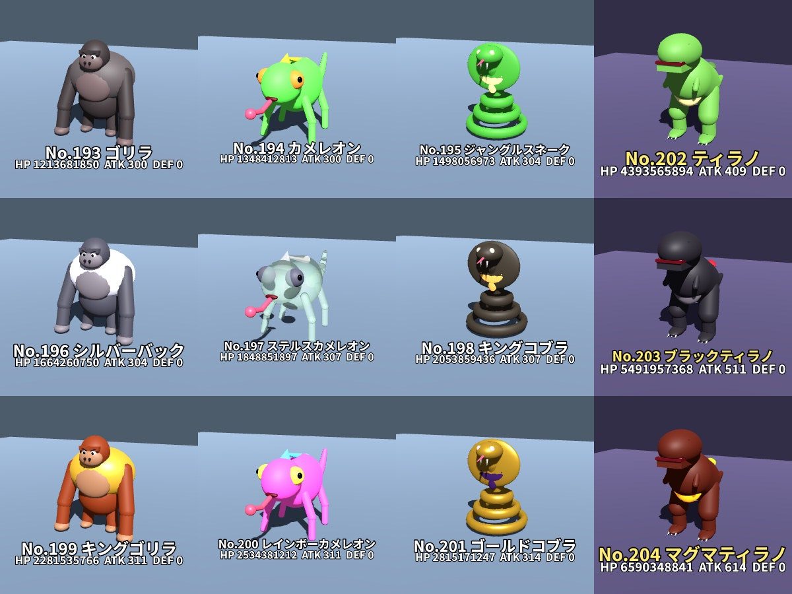

| No. | 名前 | 区分 | HP | 攻撃 | 防御 | 攻撃名 | 説明 |
|---:|---|---|---:|---:|---:|---|---|
| 193 | ゴリラ | 雑魚 | 47126148 | 243 | 0 | ドラミング | ジャングルの力もち。むねをたたくと森じゅうにひびく。 |
| 194 | カメレオン | 雑魚 | 49729400 | 246 | 0 | のびるベロ | まわりの色にとけこむトカゲ。長いベロでいきなりおそってくる。 |
| 195 | ジャングルスネーク | 雑魚 | 52475909 | 246 | 0 | どくのキバ | 木の上から落ちてくる大ヘビ。えりを広げておどかしてくる。 |
| 196 | シルバーバック | 雑魚 | 55373532 | 246 | 0 | ドラミング | ジャングルの力もち。むねをたたくと森じゅうにひびく。 |
| 197 | ステルスカメレオン | 雑魚 | 58430557 | 246 | 0 | のびるベロ | まわりの色にとけこむトカゲ。長いベロでいきなりおそってくる。 |
| 198 | キングコブラ | 雑魚 | 61655723 | 250 | 0 | どくのキバ | 木の上から落ちてくる大ヘビ。えりを広げておどかしてくる。 |
| 199 | キングゴリラ | 雑魚 | 65058247 | 250 | 0 | ドラミング | ジャングルの力もち。むねをたたくと森じゅうにひびく。 |
| 200 | レインボーカメレオン | 雑魚 | 68647851 | 250 | 0 | のびるベロ | まわりの色にとけこむトカゲ。長いベロでいきなりおそってくる。 |
| 201 | ゴールドコブラ | 雑魚 | 72434786 | 250 | 0 | どくのキバ | 木の上から落ちてくる大ヘビ。えりを広げておどかしてくる。 |
| 202 | ティラノ | **ボス** | 107001812 | 330 | 0 | きょうりゅうのキバ | ジャングルのおくで生きのこった恐竜の王。大きなあごで何でもかみくだく。 |
| 203 | ブラックティラノ | **ボス** | 133752265 | 413 | 0 | きょうりゅうのキバ | ジャングルのおくで生きのこった恐竜の王。大きなあごで何でもかみくだく。 |
| 204 | マグマティラノ | **ボス** | 160502718 | 495 | 0 | きょうりゅうのキバ | ジャングルのおくで生きのこった恐竜の王。大きなあごで何でもかみくだく。 |

## CHAPTER 18「ほしぞらの宇宙」

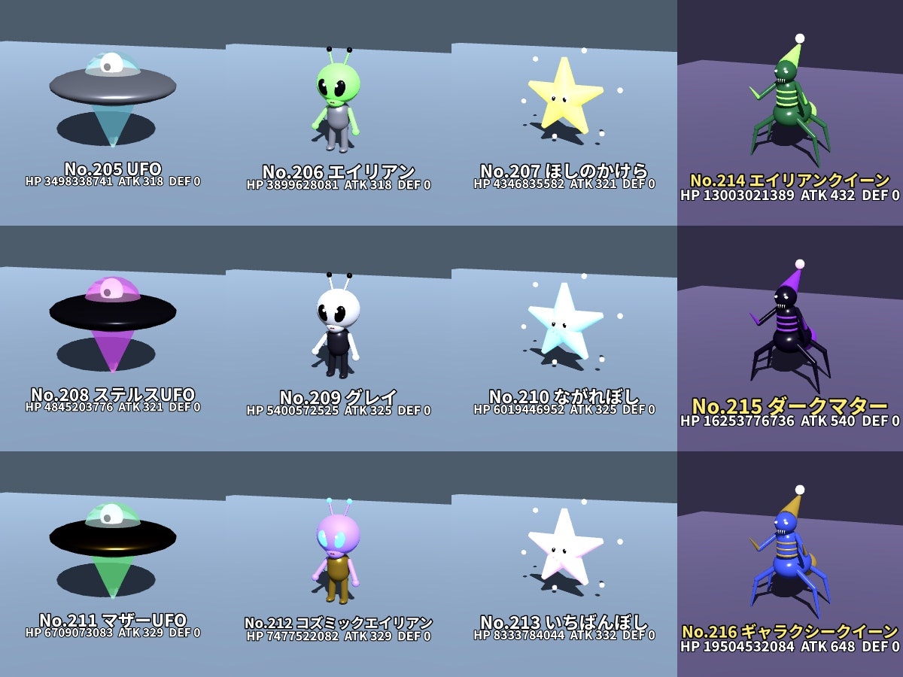

| No. | 名前 | 区分 | HP | 攻撃 | 防御 | 攻撃名 | 説明 |
|---:|---|---|---:|---:|---:|---|---|
| 205 | UFO | 雑魚 | 80644493 | 254 | 0 | キャトルビーム | 空とぶ円盤。下からのビームで何でもすいこむ。 |
| 206 | エイリアン | 雑魚 | 85090694 | 254 | 0 | サイコパワー | 遠い星から来た宇宙人。大きな頭で考えたことが現実になる。 |
| 207 | ほしのかけら | 雑魚 | 89781153 | 254 | 0 | スターダスト | 空から落ちてきた星のかけら。キラキラ光ってまぶしい。 |
| 208 | ステルスUFO | 雑魚 | 94729244 | 257 | 0 | キャトルビーム | 空とぶ円盤。下からのビームで何でもすいこむ。 |
| 209 | グレイ | 雑魚 | 99949075 | 257 | 0 | サイコパワー | 遠い星から来た宇宙人。大きな頭で考えたことが現実になる。 |
| 210 | ながれぼし | 雑魚 | 105455522 | 257 | 0 | スターダスト | 空から落ちてきた星のかけら。キラキラ光ってまぶしい。 |
| 211 | マザーUFO | 雑魚 | 111264273 | 257 | 0 | キャトルビーム | 空とぶ円盤。下からのビームで何でもすいこむ。 |
| 212 | コズミックエイリアン | 雑魚 | 117391872 | 261 | 0 | サイコパワー | 遠い星から来た宇宙人。大きな頭で考えたことが現実になる。 |
| 213 | いちばんぼし | 雑魚 | 123855768 | 261 | 0 | スターダスト | 空から落ちてきた星のかけら。キラキラ光ってまぶしい。 |
| 214 | エイリアンクイーン | **ボス** | 182944106 | 339 | 0 | ギャラクシービーム | 宇宙人たちの女王。長い頭から銀河のエネルギーをはなつ。 |
| 215 | ダークマター | **ボス** | 228680133 | 424 | 0 | ギャラクシービーム | 宇宙人たちの女王。長い頭から銀河のエネルギーをはなつ。 |
| 216 | ギャラクシークイーン | **ボス** | 274416159 | 509 | 0 | ギャラクシービーム | 宇宙人たちの女王。長い頭から銀河のエネルギーをはなつ。 |

## CHAPTER 19「ゆめのせかい」

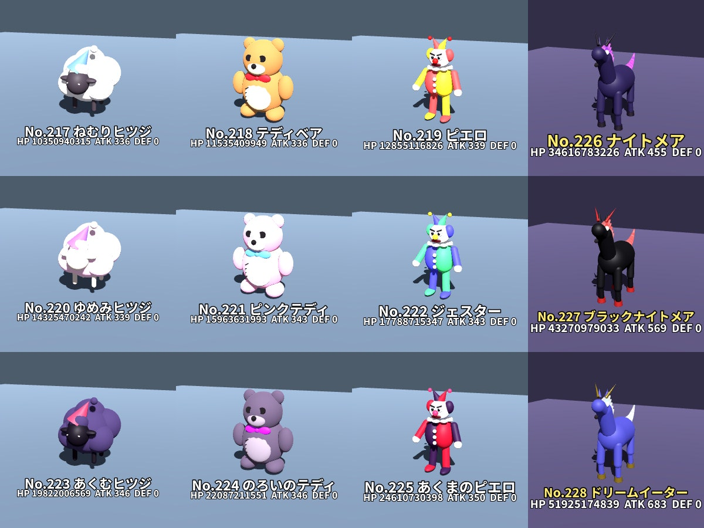

| No. | 名前 | 区分 | HP | 攻撃 | 防御 | 攻撃名 | 説明 |
|---:|---|---|---:|---:|---:|---|---|
| 217 | ねむりヒツジ | 雑魚 | 137867054 | 261 | 0 | ねむりのうた | かぞえると眠くなるヒツジ。1 ぴき、2 ひき…zzz |
| 218 | テディベア | 雑魚 | 145454310 | 264 | 0 | ぬいぐるみパンチ | 夢の中でうごきだしたぬいぐるみ。ほつれたところからわたが出ている。 |
| 219 | ピエロ | 雑魚 | 153457707 | 264 | 0 | びっくりばこ | 夢のサーカスのピエロ。わらいながらボールを投げてくる。 |
| 220 | ゆめみヒツジ | 雑魚 | 161900001 | 264 | 0 | ねむりのうた | かぞえると眠くなるヒツジ。1 ぴき、2 ひき…zzz |
| 221 | ピンクテディ | 雑魚 | 170805189 | 264 | 0 | ぬいぐるみパンチ | 夢の中でうごきだしたぬいぐるみ。ほつれたところからわたが出ている。 |
| 222 | ジェスター | 雑魚 | 180198574 | 268 | 0 | びっくりばこ | 夢のサーカスのピエロ。わらいながらボールを投げてくる。 |
| 223 | あくむヒツジ | 雑魚 | 190106841 | 268 | 0 | ねむりのうた | かぞえると眠くなるヒツジ。1 ぴき、2 ひき…zzz |
| 224 | のろいのテディ | 雑魚 | 200558131 | 268 | 0 | ぬいぐるみパンチ | 夢の中でうごきだしたぬいぐるみ。ほつれたところからわたが出ている。 |
| 225 | あくまのピエロ | 雑魚 | 211582115 | 268 | 0 | びっくりばこ | 夢のサーカスのピエロ。わらいながらボールを投げてくる。 |
| 226 | ナイトメア | **ボス** | 312494117 | 353 | 0 | あくむのいななき | 夢を食べるやみの馬。たてがみはゆらめく影でできている。 |
| 227 | ブラックナイトメア | **ボス** | 390617646 | 441 | 0 | あくむのいななき | 夢を食べるやみの馬。たてがみはゆらめく影でできている。 |
| 228 | ドリームイーター | **ボス** | 468741176 | 530 | 0 | あくむのいななき | 夢を食べるやみの馬。たてがみはゆらめく影でできている。 |

## CHAPTER 20「かみがみの領域」

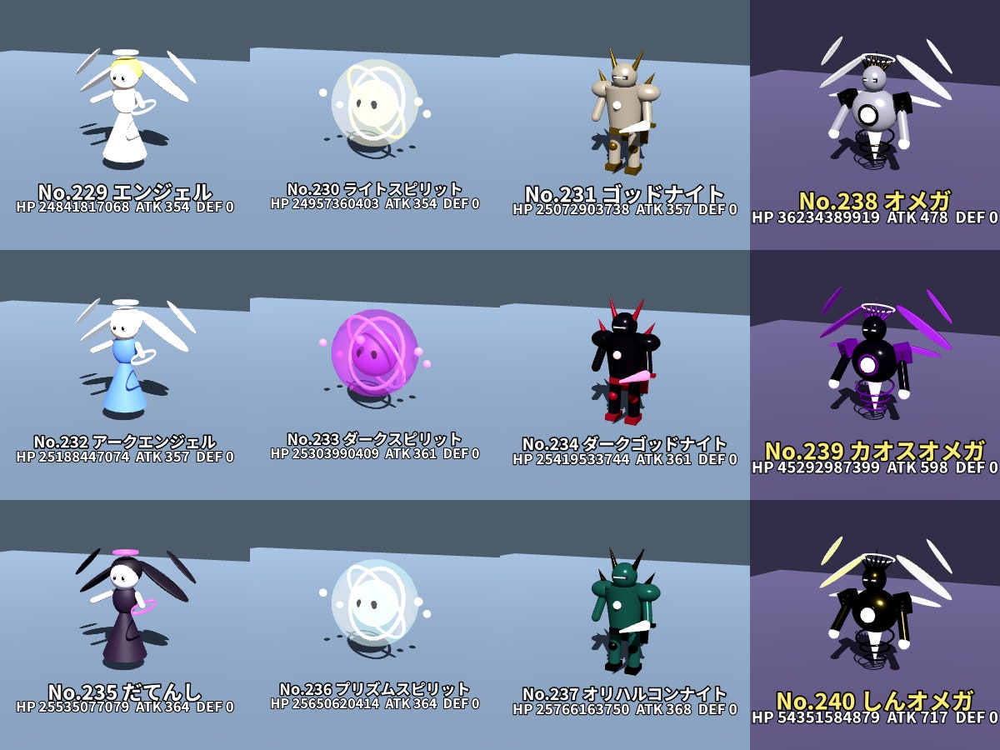

| No. | 名前 | 区分 | HP | 攻撃 | 防御 | 攻撃名 | 説明 |
|---:|---|---|---:|---:|---:|---|---|
| 229 | エンジェル | 雑魚 | 235475032 | 271 | 0 | ホーリーアロー | 神のつかい。光の弓でとおくからねらってくる。 |
| 230 | ライトスピリット | 雑魚 | 248411753 | 271 | 0 | ひかりのうず | 光そのものの精霊。まわりをまわる光のわがまぶしい。 |
| 231 | ゴッドナイト | 雑魚 | 262056936 | 271 | 0 | しんけんぎり | 神々の城を守る最強の騎士。光の大剣はどんなものも切りさく。 |
| 232 | アークエンジェル | 雑魚 | 276449267 | 275 | 0 | ホーリーアロー | 神のつかい。光の弓でとおくからねらってくる。 |
| 233 | ダークスピリット | 雑魚 | 291629540 | 275 | 0 | ひかりのうず | 光そのものの精霊。まわりをまわる光のわがまぶしい。 |
| 234 | ダークゴッドナイト | 雑魚 | 307640772 | 275 | 0 | しんけんぎり | 神々の城を守る最強の騎士。光の大剣はどんなものも切りさく。 |
| 235 | だてんし | 雑魚 | 324528320 | 275 | 0 | ホーリーアロー | 神のつかい。光の弓でとおくからねらってくる。 |
| 236 | プリズムスピリット | 雑魚 | 342340012 | 279 | 0 | ひかりのうず | 光そのものの精霊。まわりをまわる光のわがまぶしい。 |
| 237 | オリハルコンナイト | 雑魚 | 360910433 | 279 | 0 | しんけんぎり | 神々の城を守る最強の騎士。光の大剣はどんなものも切りさく。 |
| 238 | オメガ | **ボス** | 532679079 | 362 | 0 | オメガフレア | かみがみの領域の奥にいる、すべてのサイコロを作ったといわれる存在。 |
| 239 | カオスオメガ | **ボス** | 665848849 | 453 | 0 | オメガフレア | かみがみの領域の奥にいる、すべてのサイコロを作ったといわれる存在。 |
| 240 | しんオメガ | **ボス** | 799018619 | 543 | 0 | オメガフレア | かみがみの領域の奥にいる、すべてのサイコロを作ったといわれる存在。 |

